# Data-Analysis-with-Python
DonorsChoose is a US based nonprofit organization that allows individuals to donate directly to public school classroom projects. It has raised $685 million for America's classrooms. Teachers at three-quarters of all the public schools in the U.S. have come to DonorsChoose.org to request what their students need, making DonorsChoose.org the leading platform for supporting public education.

## Outline
The goal of this analysis is to extract unusual insights from school donations dataset and provide a solution that will enable DonorsChoose.org to build targeted email campaigns recommending specific classroom requests to prior donors. In this notebook, I have performed an in-depth analysis and exploration on the shared dataset using different libraries such as Pandas, Numpy, Seaborn, Scikit, Matplotlib etc.

## Insight 1: State Economy VS Donations

**Based on % free lunch provided by the school we categorize the states into economically poor or rich**
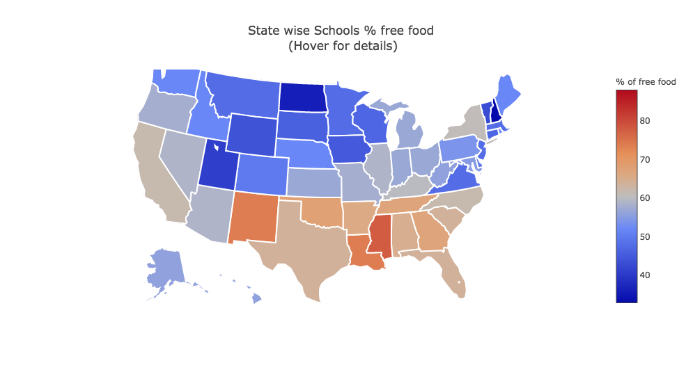
**Poor :** The average percentage of free lunch provided by the schools in District of Columbia, Mississippi, Louisiana, New Mexico, Oklahoma states are in between 67% - 87%. Which means 67% - 87% of students financially eligible for free lunch. So we can considered them as poor states.

**Rich :** The average percentage of free lunch provided by the schools in New Hampshire, North Dakota, Utah, Vermont, Wyoming are in between 30% - 45%. So we considered them as rich states.

**The number of donations that each states received**
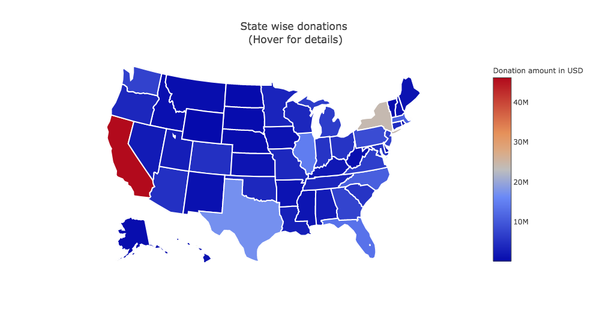
It is observed poor states get high donations compared to most of the rich states.

**Poor states get higher total donation amount compared to rich states**
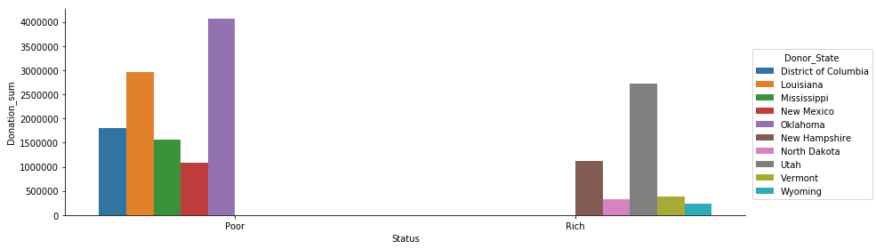

**Poor states get higher number of donations compared to rich states**
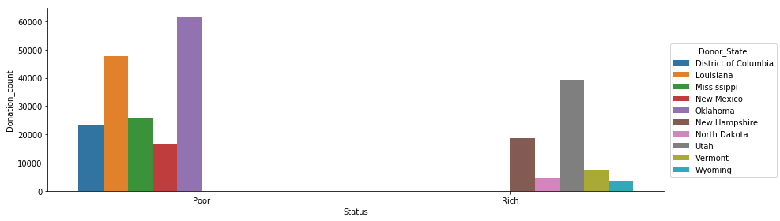

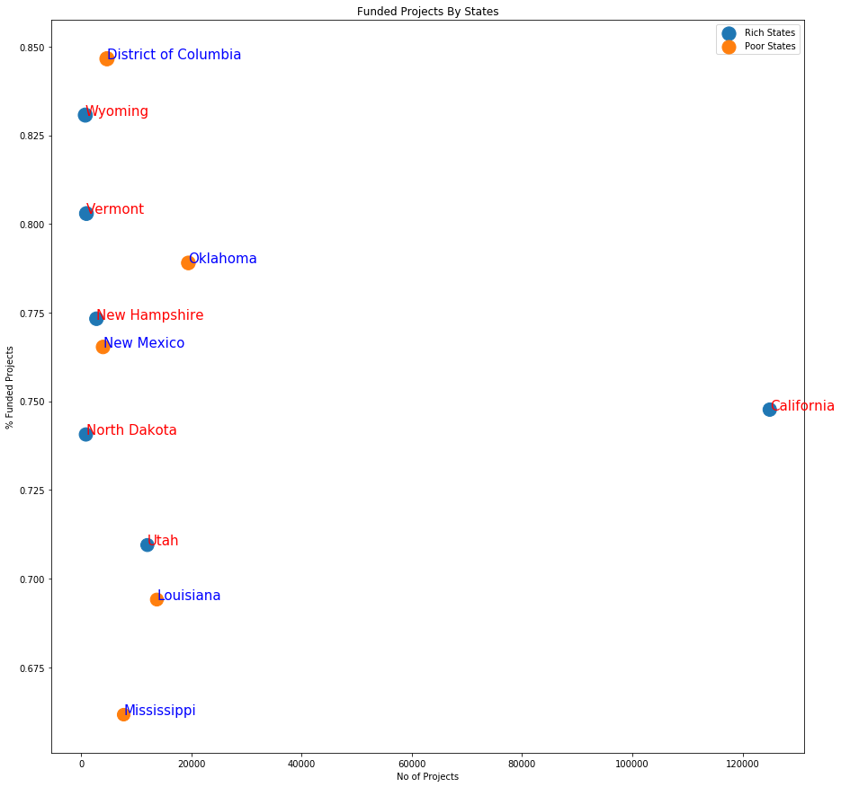

**As found initially that total donation amount of poor states  is higher compared to rich states though these poor states request less projects. The number of projects requested from poor states is low, total donation amount is also low compared to rest of the states in USA. But these poor states actually have high percentage of projects that got fully funded. People tend to donate more to schools in these states  as these state are economically poor and need projects to help them develop classroom quality and provide better education.**

**Whereas, the rich states requests for more projects as students and parents have high expectations from schools in these states. But it looks like people dont tend to donate to these states as % of free lunch is low so the families are considered to be economically wealthy and don't require classrooms to be developed as they might be getting the best education already.
Incase of California, though it has highest total donation amount, but only 75% of its projects are fully funded. This observation says that as the number of projects requested increases they don’t get funded easily.**

### Managerial insights-1:

**Based on our results we can recommend the following:**
- As the poor states have high probability of getting funded, they have to request more projects to get more donations.

## Insight 2: Projects and their Donations
### Wordcloud Analysis:
The most popular keywords used in fully funded projects were "help" and "need". We can consider these keywords attract the donor most. Moreover, in expired projects, "help" and "need" are not used much.

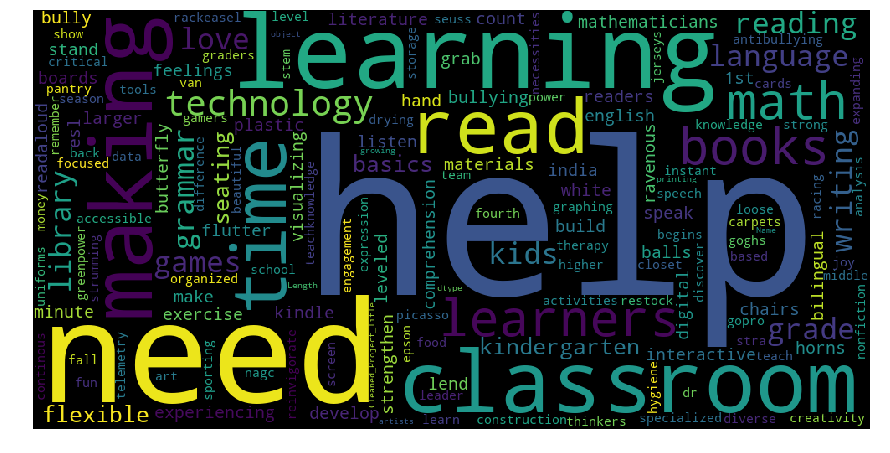

### Impact of Project Grade Level, Project Cost, Project Subject  on donations:
**No_of_donors for each Project_Grade_Level_Category**

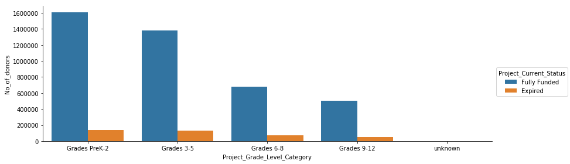
Number of donors for lower grades very high compared to higher grades.

**Impact of Project Cost**
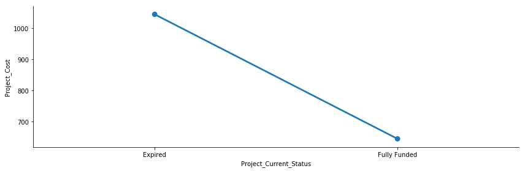
The average project cost of expired projects are very high whereas average project cost of fully funded projects are very low. So the projects with low project cost are more likely to get funded.

**Top 5 Project Subjects**
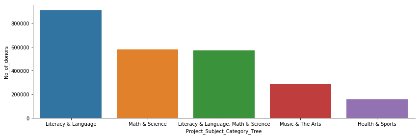
The average project cost of expired projects are very high whereas average project cost of fully funded projects are very low. So the projects with low project cost are more likely to get funded.

**Average Project Cost of top 5 Project Subjects**
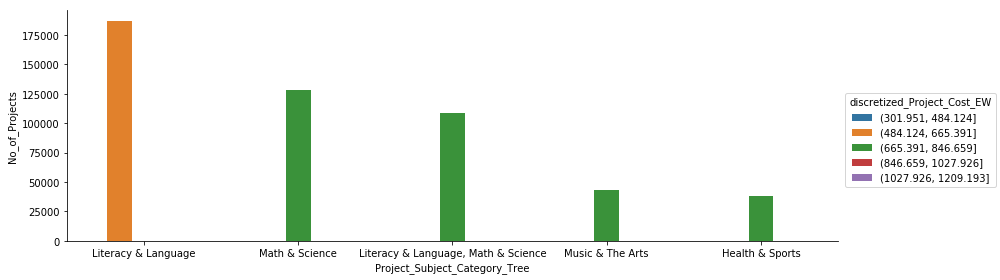
Most of the top 5 Project Subjects are of low - moderate cost which is actually the average post cost of fully funded projects.

**Overall, Post Cost and Project_Subject_Category affect donation, lower grades get more donation as their project cost is less and they focus on popular project subjects. Whereas, higher grades project cost are high and doesn’t cover popular project subject categories much. Also for higher grades, numbers of projects posted is also less compared to lower grades.**

### Managerial insight-2:
**Based on our results we can recommend the following:**
****
- Use of popular keywords like "help" & "need" in project title that attracts more donors

- The project cost must be reduced especially for higher grades and request more projects for higher grades especially on 'Literacy & Language, Math & Science' which is a popular project subject to get high donations.


## Insight 3: Seasonality pattern for donations

**Time taken for a project to be fully funded**
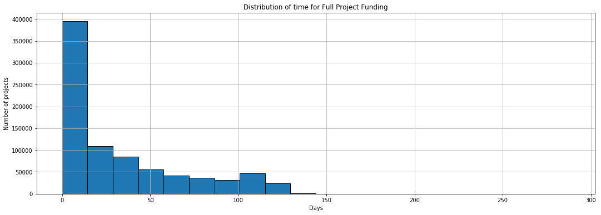

**Posted Month vs Donation received Month**
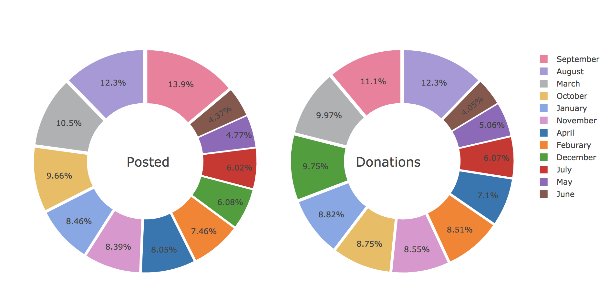

**Special occasions affect funding**
Before and after Christmas the donations are high, especially on New year eve the donations are very high.
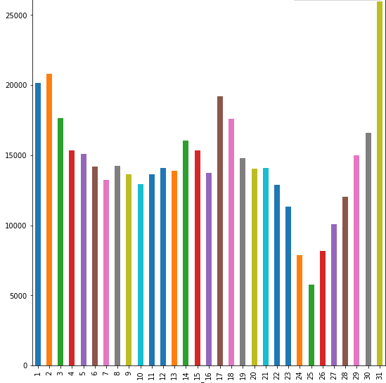

**Posted day vs donation received day**
Teachers generally post projects on weekends and every Monday there is more donations coming.
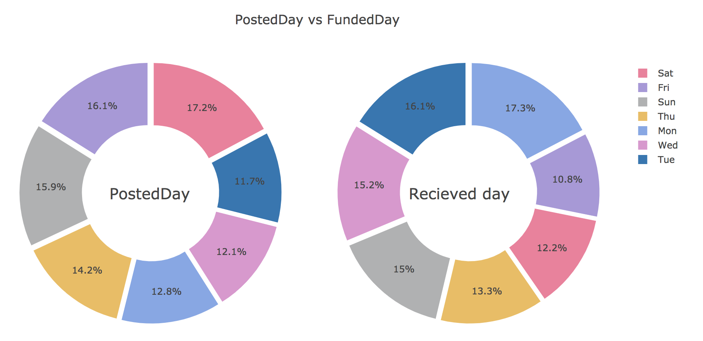

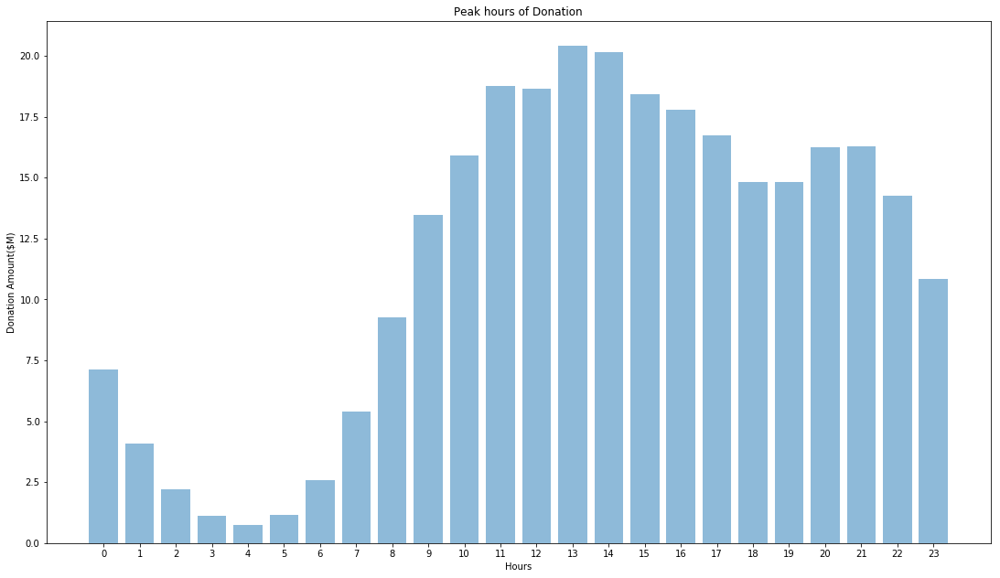

### Managerial insights-3:

**Based on our results we can recommend the following:**
- Teachers should post projects in the month of September and August.Also consider posting inecember as people tend to be generous at that time.
- Best days to post projects to donors is on weekends.Donor trends donate on Mondays between 10am-5pm.

